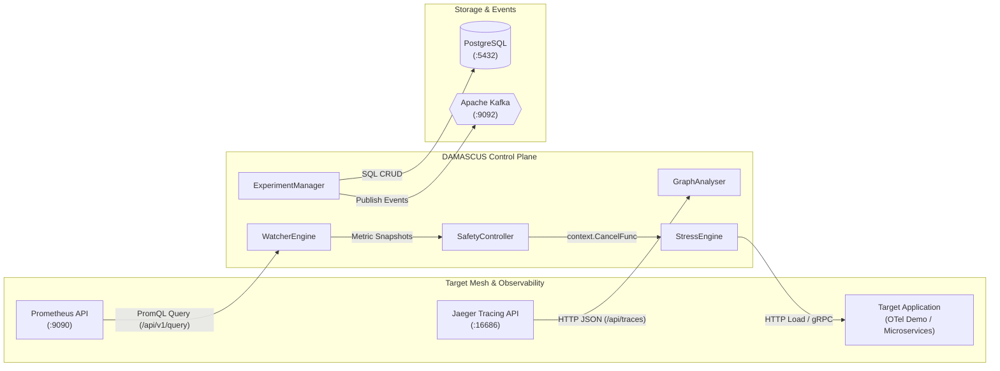

# DAMASCUS — System Architecture

**Dependency-Aware Microservice Analysis, Capacity, and Stress-Testing Utility System**

---

## 1. System Overview

Modern cloud-native architectures comprise complex networks of distributed microservices. Traditional load-testing utilities act as black boxes—hitting endpoints without topological context, downstream dependency visibility, or automated safety guarantees.

**DAMASCUS** functions as an autonomous, topology-aware control plane that:
1. **Discovers & Analyzes Dependencies**: Ingests distributed traces from Jaeger / OpenTelemetry to construct a dynamic service dependency graph and calculate structural criticality rankings.
2. **Executes Controlled Stress Testing**: Drives stepped and ramp load plans against targeted microservices.
3. **Enforces Closed-Loop Real-Time Safety**: Continuously evaluates target mesh health via sub-second Prometheus polling and terminates stress via fast-path in-memory `context.Context` cancellation.
4. **Profiles Capacity & Recovery**: Quantifies sustainable capacity limits, degradation thresholds, and post-stress recovery behavior.

---

## 2. High-Level Architecture

```text
 ┌──────────────────────────────────────────────────────────────────────────────────────────┐
 │                                TARGET MICROSERVICE ENVIRONMENT                           │
 │                                                                                          │
 │     [ Frontend ] ───> [ OrderService ] ───> [ PaymentService ] ───> [ Database ]         │
 │                                        └──> [ InventoryService ]                         │
 │                                        └──> [ ShippingService ]                          │
 └─────────────────────────────┬────────────────────────────────────────────────────────────┘
                               │ OpenTelemetry Spans & Metrics
                               ▼
 ┌──────────────────────────────────────────────────────────────────────────────────────────┐
 │                          OBSERVABILITY INFRASTRUCTURE                                    │
 │                                                                                          │
 │                ┌────────────────────────┐      ┌─────────────────────────┐               │
 │                │   Jaeger / OTel Trace  │      │    Prometheus Metrics   │               │
 │                │   HTTP API (/traces)   │      │    HTTP API (/query)    │               │
 │                └───────────┬────────────┘      └────────────┬────────────┘               │
 └────────────────────────────┼────────────────────────────────┼────────────────────────────┘
                              │                                │
                              ▼                                ▼
 ┌──────────────────────────────────────────────────────────────────────────────────────────┐
 │                             DAMASCUS CONTROL PLANE                                       │
 │                                                                                          │
 │   ┌────────────────────────┐                   ┌────────────────────────┐                │
 │   │     GraphAnalyser      │                   │     WatcherEngine      │                │
 │   │  • Trace Ingestion     │                   │  • Sub-second Polling  │                │
 │   │  • Criticality Scoring │                   │  • RED Metrics Stream  │                │
 │   └───────────┬────────────┘                   └────────────┬───────────┘                │
 │               │                                             │                            │
 │               ▼                                             ▼                            │
 │   ┌─────────────────────────────────────────────────────────────────────┐                │
 │   │              ExperimentManager (8-State Machine)                    │                │
 │   │              [CREATED ➔ PLANNED ➔ RUNNING ➔ STOPPING...]            │                │
 │   └───────────┬─────────────────────────────────────────────┬───────────┘                │
 │               │                                             │                            │
 │               │ Dispatches Workers                          │ Evaluates Thresholds       │
 │               ▼                                             ▼                            │
 │   ┌────────────────────────┐                   ┌────────────────────────┐                │
 │   │      StressEngine      │ ◀─── Cancel ──────│    SafetyController    │                │
 │   │  • HTTP Worker Pools   │    (Fast-Path)    │  • Latency / Error SLA │                │
 │   │  • Step/Ramp Traffic   │                   │  • Sub-second Safety   │                │
 │   └───────────┬────────────┘                   └────────────┬───────────┘                │
 │               │                                             │                            │
 │               └──────────────────────┬──────────────────────┘                            │
 │                                      ▼                                                   │
 │                        ┌───────────────────────────┐                                     │
 │                        │     CapacityAnalyzer      │                                     │
 │                        │  • Sustainable Rate       │                                     │
 │                        │  • Degradation Knee       │                                     │
 │                        │  • Recovery Duration      │                                     │
 │                        └─────────────┬─────────────┘                                     │
 └──────────────────────────────────────┼───────────────────────────────────────────────────┘
                                        │
                 ┌──────────────────────┴──────────────────────┐
                 ▼                                             ▼
 ┌───────────────────────────────┐             ┌────────────────────────────────┐
 │        PostgreSQL DB          │             │     Kafka Event Backbone       │
 │  • Experiments & Observations │             │  • Topic: `experiment-events`  │
 │  • Dependency Graphs & Scores │             │  • Audit Logs & Alert Stream   │
 │  • Final Capacity Reports     │             │  • Real-Time Dashboard Events  │
 └───────────────────────────────┘             └────────────────────────────────┘
```

---

## 3. Core Architectural Principles

### 3.1 Observability Decoupling & Target Flexibility
DAMASCUS does not require embedding invasive agents or proprietary SDKs inside target microservices. It connects directly to standard cloud observability backends:
- **Distributed Tracing**: Ingested via standard Jaeger HTTP API (`/api/traces`) or OpenTelemetry collector exporters.
- **Time-Series Metrics**: Scraped via standard Prometheus HTTP API (`/api/v1/query`, `/api/v1/query_range`).
- **Load Generation**: Injected over standard HTTP/1.1 or gRPC interfaces.

> [!NOTE]
> This design allows DAMASCUS to test any pre-instrumented architecture—including the official **OpenTelemetry Astronomy Shop Demo** or enterprise production-like environments—without modifying application source code.

### 3.2 Closed-Loop Safety (MAPE-K Framework)
DAMASCUS implements an autonomous closed-loop feedback controller:
1. **Monitor**: `WatcherEngine` polls target service RED metrics (Rate, Error, Duration) from Prometheus every second.
2. **Analyze**: `SafetyController` evaluates observations against strict non-functional constraints ($P_{95} \le \text{Threshold}$, $\text{ErrorRate} \le \text{MaxError}$, $\text{Availability} \ge \text{MinAvail}$).
3. **Plan & Execute**: If an SLA invariant is breached, safety stop logic fires immediately.

> [!IMPORTANT]
> **Fast-Path Context Cancellation**: Emergency safety halts use Go's in-memory `context.CancelFunc` directly. This eliminates any network latency, message queue lag, or broker dependency from the critical safety path.

### 3.3 Event Streaming with Kafka vs. Fast-Path Safety
A common architectural consideration is: *Why use Kafka if safety halts bypass it?*

| Concern | Implementation Path | Rationale |
| :--- | :--- | :--- |
| **Emergency Safety Stop** | Direct in-memory Go `context.CancelFunc` | Sub-second, zero-dependency fail-safe. If Kafka experiences network partitions or broker lag, safety is never compromised. |
| **Domain Event Distribution** | Kafka (`experiment-events` topic) | Asynchronous fan-out for multi-subscriber architectures: audit logging, external SIEM alerting, live WebSocket dashboard streams, and downstream analytical jobs. |
| **Persistent Storage** | PostgreSQL | ACID-compliant relational storage for experiment configurations, time-series observation records, and final capacity reports. |

---

## 4. Key Component Roles & Contracts

| Component | Primary Responsibility | Inputs | Outputs |
| :--- | :--- | :--- | :--- |
| **`GraphAnalyser`** | Reconstructs service topology from traces and scores structural criticality. | Jaeger Trace Spans (`/api/traces`) | `DependencyGraph`, `[]ServiceScore` with rationale |
| **`ExperimentManager`** | Coordinates the 8-state experiment lifecycle state machine. | REST API / UI Commands | State transitions, orchestrator commands |
| **`StressEngine`** | Generates stepped/ramp HTTP traffic via coordinated worker pools. | `stress.LoadPlan`, execution `context.Context` | HTTP traffic to target endpoints |
| **`WatcherEngine`** | Polls Prometheus at 1-second intervals for real-time RED metrics. | Prometheus HTTP API (`/api/v1/query`) | Channel of `watcher.MetricSnapshot` |
| **`SafetyController`** | Evaluates metric snapshots against safety bounds; triggers cancel. | `watcher.MetricSnapshot`, `safety.SafetyPolicy` | `safety.SafetyDecision` (Stop flag & Reason) |
| **`CapacityAnalyzer`** | Computes sustainable throughput, degradation knees, and recovery time. | Historical `[]capacity.Observation` array | `capacity.CapacityResult` |
| **`ReportEngine`** | Synthesizes experiment results into structured JSON and HTML artifacts. | Experiment metadata, Scores, CapacityResult | JSON and HTML Report artifacts |
| **`Kafka Producer`** | Streams domain events (`experiment-events`) to the event backbone. | State changes, threshold breaches, safety events | Kafka topic messages |

---

## 5. Network & Integration Interfaces



1. **DAMASCUS $\leftrightarrow$ Target Microservices**: HTTP/1.1 or gRPC load generation from `StressEngine` workers.
2. **DAMASCUS $\leftrightarrow$ Jaeger**: HTTP REST API (`/api/traces`, `/api/dependencies`) for trace span ingestion.
3. **DAMASCUS $\leftrightarrow$ Prometheus**: HTTP PromQL API (`/api/v1/query`, `/api/v1/query_range`).
4. **DAMASCUS $\leftrightarrow$ PostgreSQL**: Relational persistence using standard `database/sql` (`pgx` driver).
5. **DAMASCUS $\leftrightarrow$ Kafka**: Binary TCP protocol using `franz-go` or `sarama` on topic `experiment-events`.
