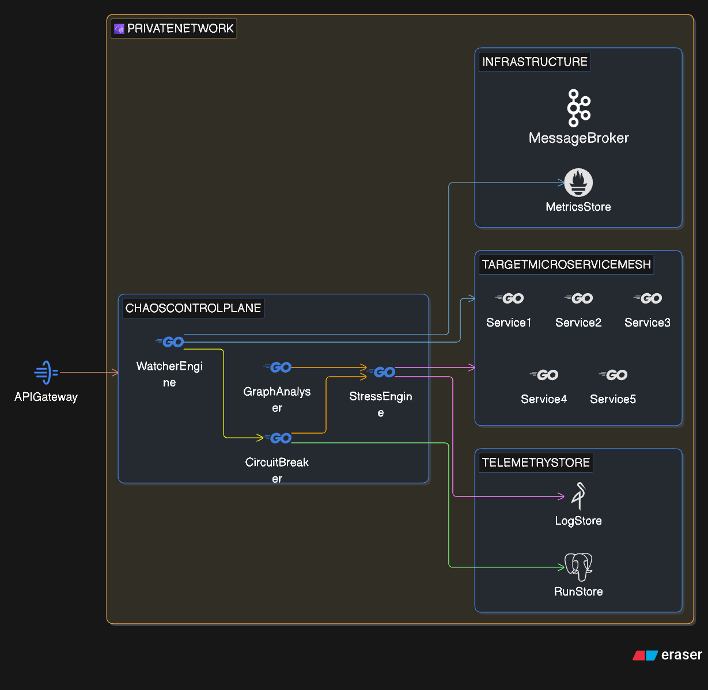

# DAMASCUS — System Architecture

**Dependency-Aware Microservice Analysis, Capacity, and Stress-testing Utility System**

---

## 1. System Overview

Modern cloud-native applications rely on complex microservice topologies where failure or capacity limits in a single service can propagate throughout the entire ecosystem. Traditional load testing tools blindly hit endpoints without understanding application dependency structures or system criticality.

**DAMASCUS** bridges this gap by acting as an intelligent, autonomous distributed control plane that:
1. **Discovers & Ranks** microservices by topological and operational criticality using dependency graph analysis.
2. **Stress-tests Safely** targeted microservices using adaptive or stepwise load generation.
3. **Observes & Protects** the target mesh using an independent real-time safety loop with context cancellation.
4. **Analyzes & Reports** sustainable capacity limits, degradation points, and post-stress recovery behavior.

---

## 2. High-Level Architecture Diagram

---

## 3. Core Architectural Principles

### 3.1 Control Plane vs. Data Plane Isolation
- **Control Plane**: DAMASCUS runs as a standalone modular Go binary responsible for analysis, orchestration, monitoring, and safety.
- **Data Plane (Target Mesh)**: The target application (5 containerized microservices: Gateway, Order, Payment, Inventory, Recommendation) operates independently in isolated containers/pods.

### 3.2 Safety-First Closed Control Loop (MAPE-K)
DAMASCUS implements an autonomous MAPE-K control loop:
- **Monitor**: `WatcherEngine` continuously polls Prometheus at sub-second intervals.
- **Analyze**: `SafetyController` evaluates latency (P95/P99), error rates, and availability against strict policies.
- **Plan & Execute**: If a threshold is breached, the `SafetyController` invokes Go `context.Context` cancellation instantly.
- **Direct Fast-Path**: Safety termination is direct in-memory goroutine signaling, eliminating network latency or Kafka dependency for emergency stops.

### 3.3 Asynchronous Event Backbone
- **Kafka** acts as an event distribution stream (`experiment-events`) for auditing, notifications, and secondary consumers (reporters, alerts).
- **PostgreSQL** stores durable domain entities (experiment metadata, scoring results, final capacity metrics).
- **Prometheus** handles time-series metrics.

---

## 4. Key Component Roles

| Component | Responsibility | Inputs | Outputs |
| :--- | :--- | :--- | :--- |
| **`ExperimentManager`** | Coordinates experiment lifecycle & state machine transitions. | REST requests / UI inputs | State updates, execution commands |
| **`GraphAnalyser`** | Computes dependency topology and ranks services by criticality score. | OpenTelemetry trace data / Telemetry graph | Ranked `ServiceScore` list with reasons |
| **`StressEngine`** | Spawns goroutine worker pools to generate stepped/ramp HTTP traffic. | `LoadPlan` & execution `context.Context` | HTTP traffic to target microservice |
| **`WatcherEngine`** | Periodically queries Prometheus for P50/P95/P99 latency, error rates, CPU/Mem. | Prometheus HTTP API | `MetricSnapshot` stream |
| **`SafetyController`** | Evaluates metrics against threshold rules; cancels context on breach. | `MetricSnapshot` | `SafetyDecision` (Stop flag & Reason) |
| **`CapacityAnalyzer`** | Computes maximum sustainable rate, degradation points, and recovery duration. | Array of `Observation` snapshots | `CapacityResult` struct |
| **`ReportEngine`** | Assembles full experiment context into human-readable JSON/HTML summaries. | Experiment, Scores, Metrics, Capacity | Final JSON / HTML report artifacts |

---

## 5. Network & Integration Interfaces

1. **DAMASCUS $\leftrightarrow$ Target Microservices**: HTTP/1.1 or gRPC load injection from `StressEngine` workers.
2. **DAMASCUS $\leftrightarrow$ Prometheus**: HTTP PromQL API (`/api/v1/query_range` & `/api/v1/query`).
3. **DAMASCUS $\leftrightarrow$ OpenTelemetry**: Tracing collector telemetry API / dependency graph extraction.
4. **DAMASCUS $\leftrightarrow$ PostgreSQL**: standard SQL via `database/sql` driver (pgx/pq).
5. **DAMASCUS $\leftrightarrow$ Kafka**: Sarama / franz-go Kafka producer for `experiment-events`.
