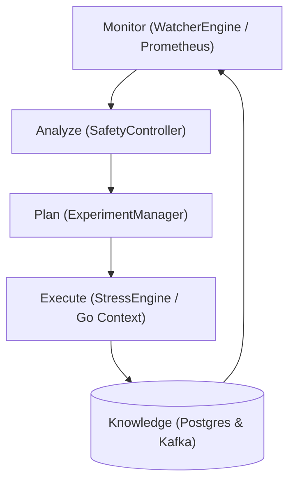

# DAMASCUS — Cloud Computing Core Concepts & Academic Mapping

**Cloud Computing Principles, Architectural Patterns, and Course Justification**

---

## 1. Overview & Cloud Relevance

DAMASCUS is designed specifically as an enterprise-grade cloud-native control plane system. It addresses core challenges in distributed systems engineering: **capacity planning**, **cascading degradation**, **observability-driven autoscaling evaluation**, and **resilient feedback loops**.

---

## 2. Key Cloud Computing Patterns Implemented

### 2.1 Autonomous Control Loops (MAPE-K Framework)
In cloud computing, autonomous systems rely on the **Monitor-Analyze-Plan-Execute over Knowledge** (MAPE-K) feedback loop:
- **Monitor**: `WatcherEngine` scrapes real-time telemetry from Prometheus.
- **Analyze**: `SafetyController` compares empirical metric snapshots against non-functional SLA invariants.
- **Plan**: `ExperimentManager` updates state machine and prepares cancellation signals.
- **Execute**: `StressEngine` workers adapt or abort traffic generation in real time.
- **Knowledge**: `PostgreSQL` + `Kafka` preserve historical trace scores, degradation points, and telemetry history.

### 2.2 Control Plane vs. Data Plane Decomposition
Similar to Kubernetes (`kube-apiserver` / `etcd` vs. worker node Pods) or Service Meshes (Istio Control Plane vs. Envoy Data Plane proxies):
- **Control Plane**: DAMASCUS Go control process runs orchestrators, scoring algorithms, and analysis engines without handling production end-user requests.
- **Data Plane**: The microservices mesh under test handles data requests. Stress testing occurs over the data plane while monitoring occurs via sidecars/telemetry agents.

### 2.3 Cascading Failure & Blast Radius Management
Microservices suffer from catastrophic propagation of failure (e.g. latency backpressure upstream when a database connection pool is exhausted downstream). 
- DAMASCUS's **Dependency Graph Criticality Scoring** isolates high-impact single points of failure (SPOFs) before performing load tests.
- **Circuit Breaking via Context Cancellation**: Prevents uncontrolled stress tests from bringing down the entire cluster.

### 2.4 Cloud Observability & Telemetry Integration
- **Metrics (Prometheus)**: Time-series scraping of RED metrics (Rate, Errors, Duration) and USE metrics (Utilization, Saturation, Errors).
- **Traces (OpenTelemetry)**: Distributed context propagation allowing automatic graph topology construction.

### 2.5 Horizontal Pod Autoscaler (HPA) vs. Capacity Bounds
When deploying target microservices on Kubernetes with HPA enabled:
- DAMASCUS evaluates the lag between **traffic spike $\rightarrow$ HPA pod creation $\rightarrow$ pod readiness $\rightarrow$ latency stabilization**.
- Demonstrates whether auto-scaling keeps up with step-rate load increases or if rate limits are breached prior to pod initialization.

---

## 3. Comparative Matrix: Traditional Load Testing vs. DAMASCUS

| Capability | Traditional Tools (JMeter, Locust, k6) | DAMASCUS Platform |
| :--- | :--- | :--- |
| **Topology Awareness** | Black-box / None (hits pre-configured URLs) | **Full Dependency Graph** derived from telemetry |
| **Target Selection** | Manual / Arbitrary | **Automated Criticality Ranking** (In-degree, PageRank, SPOF) |
| **Safety Mechanisms** | Script timeout or manual cancellation | **Autonomous Closed-Loop Safety Controller** (Sub-second context stop) |
| **Degradation Detection** | Static post-test manual chart inspection | **Automated Capacity & Recovery Threshold Analysis** |
| **Event Backbone** | Standalone CSV / JSON logs | **Asynchronous Kafka Event Streaming** (`experiment-events`) |

---

## 4. Evaluation Metrics for Course Defense

1. **Topological Scoring Accuracy**: Verifying that core shared dependencies (e.g. `Payment` or `Database`) receive higher criticality scores than peripheral leaf services (e.g. `Recommendation`).
2. **Safety Stop Reaction Time**: Measuring milliseconds elapsed between Prometheus metric breach and zero traffic output from `StressEngine`.
3. **Recovery Time Objective (RTO)**: Measuring duration required for microservice P95 latency to return to baseline after stress engine shutdown.
4. **HPA Convergence Lag**: Analyzing system degradation when load ramp rate exceeds Kubernetes container spinning speed.
