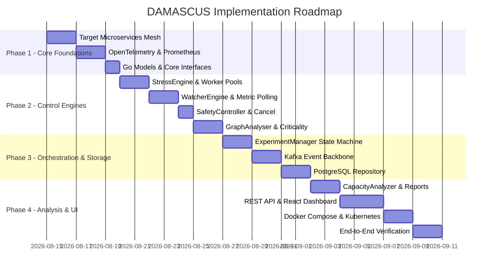

# DAMASCUS — Implementation Roadmap & Execution Plan

**Step-by-Step Multi-Phase Implementation Plan**

---

## Roadmap Overview

To ensure clean, bug-free implementation and easy debugging, DAMASCUS is divided into **14 sequential development phases**.

---

## Detailed Phase Breakdown

### Phase 1: Target Microservice Mesh Setup
- Build 5 lightweight Go microservices:
  1. `Gateway`
  2. `Order Service`
  3. `Payment Service`
  4. `Inventory Service`
  5. `Recommendation Service`
- Configure downstream RPC calls (`Gateway` $\rightarrow$ `Order` $\rightarrow$ `Payment`, `Inventory`, `Recommendation`).
- Inject artificial latency and configurable failure modes.

### Phase 2: Observability Pipeline
- Instrument services with OpenTelemetry trace exporters.
- Setup Prometheus scraping target endpoints (`/metrics`).
- Verify trace dependency trees in OpenTelemetry and time-series metrics in Prometheus dashboard.

### Phase 3: Go Project Domain & Interfaces
- Initialize Go module (`go mod init damascus`).
- Create directory structure (`cmd/`, `internal/api`, `internal/experiment`, `internal/graph`, `internal/stress`, etc.).
- Write core domain types, enums, DTOs, and Go interface contracts.

### Phase 4: StressEngine & Worker Pools
- Implement HTTP load generation workers with rate-limiting tickers (`time.Ticker`).
- Support ramp-up and step-rate load plans.
- Ensure goroutines terminate cleanly on `context.Context` signal.

### Phase 5: WatcherEngine & Prometheus Client
- Implement Prometheus HTTP API client querying P50, P95, P99, error rates, CPU/Memory metrics.
- Stream periodic `MetricSnapshot` structures via Go channels.

### Phase 6: SafetyController & Context Cancellation
- Build `SafetyController` threshold evaluation logic.
- Connect `WatcherEngine` $\rightarrow$ `SafetyController` $\rightarrow$ `context.CancelFunc` fast-path execution.

### Phase 7: GraphAnalyser & Criticality Scoring
- Construct internal `DependencyGraph` structure from trace topology.
- Implement scoring algorithm (In-Degree, Out-Degree, Frequency, Depth, SPOF weighting).
- Generate explainable reasons array for service rankings.

### Phase 8: ExperimentManager Orchestrator
- Implement the 8-state Experiment State Machine (`CREATED` $\rightarrow$ `PLANNED` $\rightarrow$ `RUNNING` $\rightarrow$ `STOPPING` $\rightarrow$ `ANALYZING` $\rightarrow$ `REPORTING` $\rightarrow$ `COMPLETED`).
- Wire component interfaces into central orchestrator struct.

### Phase 9: Kafka Event Backbone
- Setup Kafka topic `experiment-events`.
- Implement `KafkaEventProducer` using Sarama or `franz-go`.
- Stream state changes, metric breaches, and safety stops to Kafka.

### Phase 10: PostgreSQL Repository
- Write Database Migration DDLs (`schema.sql`).
- Implement `PostgresExperimentRepository` for SQL CRUD operations.

### Phase 11: CapacityAnalyzer & ReportEngine
- Implement deterministic capacity algorithms (Max Tested Rate, Max Sustainable Rate, Degradation Point, Recovery Time).
- Write `ReportEngine` generating structured JSON reports and clean HTML dashboards.

### Phase 12: REST API & React Dashboard
- Write HTTP API handlers (`net/http` or `chi` router).
- Build modern React UI dashboard for dependency graph visualization, live metric telemetry graphs, and capacity reports.

### Phase 13: Packaging (Docker Compose & Kubernetes)
- Write `docker-compose.yml` bundling target mesh, DAMASCUS binary, Postgres, Kafka, Prometheus, and React UI.
- Write Kubernetes manifests (Deployments, Services, ConfigMaps, HPA).

### Phase 14: Verification & Course Presentation
- Run end-to-end stress test scenarios.
- Generate capacity reports and test failure injection scenarios.
