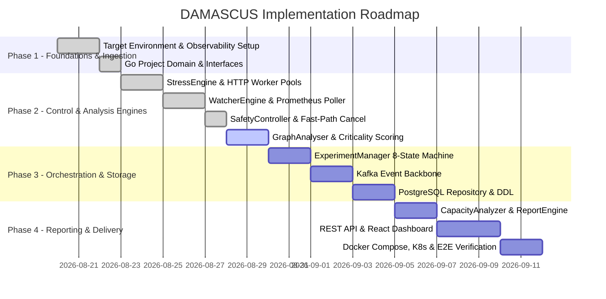

# DAMASCUS — Implementation Roadmap & Execution Checklist

> **Telemetry-Driven Autonomous Resilience & Capacity Testing Platform**
> 
> *For detailed daily updates, authorship, and logic rationale, see **[`docs/PROGRESS.md`](PROGRESS.md)**.*

---

## 🗺️ Roadmap Overview

DAMASCUS is divided into **12 structured development phases**. By targeting standard OpenTelemetry environments (such as the official **OpenTelemetry Astronomy Shop Demo**) or any pre-instrumented microservice mesh, development is focused on the core **DAMASCUS Control Plane**, graph scoring algorithms, real-time safety enforcement, and capacity analysis.

---

## ✅ Master Implementation Checklist

### Phase 1: Target Environment & Observability Ingestion
> [!NOTE]
> DAMASCUS connects to standard cloud observability backends (Jaeger and Prometheus), allowing it to target standard suites like the OpenTelemetry Astronomy Shop Demo without manual microservice boilerplate.

- [x] **1.1 Observability Stack Deployment**
  - [x] Deploy OpenTelemetry Astronomy Shop Demo (or target mesh) with OTel Collector, Jaeger, and Prometheus.
  - [x] Verify Jaeger tracing web UI and API availability (`http://localhost:16686`).
  - [x] Verify Prometheus metrics endpoint scraping target services (`http://localhost:9090`).
- [x] **1.2 Ingestion & Connectivity Probing**
  - [x] Test Jaeger traces retrieval (`GET /api/traces?service=frontend`).
  - [x] Test Jaeger dependencies graph retrieval (`GET /api/dependencies`).
  - [x] Test Prometheus PromQL RED metrics queries (Rate, Error, Duration P50/P95/P99).
  - [x] Implement `CheckObservabilityStack(ctx)` connectivity probe in Go (`internal/observability/checker.go`).

---

### Phase 2: Go Domain Models & Interface Contracts
- [x] **2.1 Directory Structure Scaffolding**
  - [x] `cmd/demo/` (interactive multi-scenario verification demo).
  - [x] `internal/config/` (environment configuration & health statuses).
  - [x] `internal/graph/` (dependency graph models & scoring logic).
  - [x] `internal/stress/` (load engine & worker pool).
  - [x] `internal/watcher/` (Prometheus metric poller).
  - [x] `internal/safety/` (safety controller & SLA evaluations).
  - [x] `internal/experiment/` (orchestrator & 8-state machine).
  - [x] `internal/capacity/` (capacity & recovery calculations).
- [x] **2.2 Core Domain Structs & Enums**
  - [x] Define `ExperimentState`, `ExperimentType`, `ExperimentConfig`, `Experiment`.
  - [x] Define `DependencyGraph`, `ServiceNode`, `DependencyEdge`, `ServiceScore`.
  - [x] Define `LoadPlan`, `MetricSnapshot`, `SafetyPolicy`, `SafetyDecision`.
  - [x] Define `Observation`, `CapacityResult`, `ExperimentReport`.
- [ ] **2.3 Core Top-Level Interfaces Package**
  - [ ] Consolidate global interface contracts for cross-package dependency injection.

---

### Phase 3: StressEngine & HTTP Worker Pools
- [x] **3.1 Load Generation Engine**
  - [x] Implement rate-regulated worker pool using high-precision 10ms tick accumulator (`internal/stress/engine.go`).
  - [x] Support stepped load plans (`InitialRate` $\rightarrow$ `StepRate` per `StepDurationSeconds`).
  - [x] Lock-free atomic metric counters (`TotalRequests`, `SuccessCount`, `ErrorCount`, `DroppedCount`).
- [x] **3.2 Concurrency & Fast Teardown**
  - [x] Bind worker goroutines strictly to execution `context.Context`.
  - [x] Implement immediate zero-leak goroutine termination on `<-ctx.Done()`.
  - [x] Unit tests for rate precision, step transitions, and cancellation responsiveness (`internal/stress/engine_test.go`).

---

### Phase 4: WatcherEngine & Prometheus Poller
- [x] **4.1 PromQL Client Implementation**
  - [x] Implement sub-second PromQL query client for request rate (RPS) (`internal/watcher/poller.go`).
  - [x] Query P50, P95, and P99 latency percentiles via histogram quantiles.
  - [x] Calculate error rate percentage (`5xx` errors / total requests) and availability.
  - [x] Scrape CPU and Memory container utilization metrics where available.
- [x] **4.2 Streaming Metric Snapshots**
  - [x] Stream snapshots through Go channel (`<-chan watcher.MetricSnapshot`).
  - [x] Handle Prometheus query timeouts and network resilience.
  - [x] Unit & integration tests against mock Prometheus API server (`internal/watcher/poller_test.go`).

---

### Phase 5: SafetyController & Fast-Path Context Cancellation
> [!IMPORTANT]
> Emergency halts execute directly in-memory via `context.CancelFunc()`, guaranteeing sub-millisecond reaction times independent of Kafka or network stability.

- [x] **5.1 Threshold Evaluation Logic**
  - [x] Implement SLA limit checks: P95 latency > `MaxP95LatencyMs` (`internal/safety/controller.go`).
  - [x] Implement SLA limit checks: Error rate > `MaxErrorRate`.
  - [x] Implement SLA limit checks: Availability < `MinAvailability`.
- [x] **5.2 Fast-Path Circuit Breaker Wiring**
  - [x] Connect `WatcherEngine` $\rightarrow$ `SafetyController` $\rightarrow$ `context.CancelFunc`.
  - [x] Benchmark cancellation latency to verify sub-millisecond execution in interactive demo.
  - [x] Unit tests with boundary threshold fixtures (`internal/safety/controller_test.go`).

---

### Phase 6: GraphAnalyser & Criticality Scoring Engine
- [ ] **6.1 Trace Ingestion & Graph Construction**
  - [ ] Query Jaeger trace API (`/api/traces` and `/api/dependencies`).
  - [ ] Construct directed `DependencyGraph` with nodes and weighted edges (call counts & frequencies).
- [ ] **6.2 Criticality Scoring Formula**
  - [ ] Calculate $\text{InDegree}(v)$, $\text{OutDegree}(v)$, $\text{CallFreq}(v)$, $\text{Depth}(v)$, $\text{SPOF}(v)$.
  - [ ] Compute weighted normalized score $S(v) \in [0.0, 1.0]$.
  - [ ] Generate human-readable rationale explanations for each score.
  - [ ] Unit tests verifying score accuracy against complex multi-tier topologies.

---

### Phase 7: ExperimentManager (8-State Orchestrator)
- [ ] **7.1 State Machine Implementation**
  - [ ] Implement states: `CREATED` $\rightarrow$ `PLANNED` $\rightarrow$ `RUNNING` $\rightarrow$ `STOPPING` $\rightarrow$ `ANALYZING` $\rightarrow$ `REPORTING` $\rightarrow$ `COMPLETED` (or `ABORTED`).
  - [ ] Enforce valid state transition matrix and reject invalid jumps.
- [ ] **7.2 Component Lifecycle Orchestration**
  - [ ] Initialize execution contexts and wire `StressEngine`, `WatcherEngine`, `SafetyController`.
  - [ ] Manage post-stress recovery cooldown observation window.
  - [ ] Unit tests for end-to-end state machine transitions and error recovery.

---

### Phase 8: Kafka Event Backbone
- [ ] **8.1 Kafka Producer Implementation**
  - [ ] Setup Kafka producer client using `franz-go` or `sarama`.
  - [ ] Implement JSON serialization for `DomainEvent` envelopes.
- [ ] **8.2 Asynchronous Domain Event Streaming**
  - [ ] Publish state transition events (`EXPERIMENT_STARTED`, `EXPERIMENT_STOPPED`, etc.).
  - [ ] Publish safety breach events (`SAFETY_STOP_TRIGGERED`) asynchronously.
  - [ ] Publish metric snapshot feeds to topic `experiment-events`.
  - [ ] Integration tests verifying event delivery to Kafka brokers.

---

### Phase 9: PostgreSQL Repository & Persistence
- [ ] **9.1 DDL Schema & Database Migrations**
  - [ ] Create migration script `schema.sql` for tables:
    - [ ] `services` & `dependencies`
    - [ ] `experiments` & `service_scores`
    - [ ] `observations` & `safety_events`
    - [ ] `reports`
- [ ] **9.2 SQL Repository Layer**
  - [ ] Implement `PostgresExperimentRepository` with `database/sql` & `pgx`.
  - [ ] Implement transactions for state updates and bulk observation inserts.
  - [ ] Integration tests using real or containerized PostgreSQL instance.

---

### Phase 10: CapacityAnalyzer & ReportEngine
- [ ] **10.1 Capacity Analytics Engine**
  - [ ] Calculate **Maximum Tested Rate** (highest RPS injected).
  - [ ] Calculate **Maximum Sustainable Rate** (highest RPS meeting all SLA bounds).
  - [ ] Detect **Degradation Point** (exact RPS where latency/error inflection occurs).
  - [ ] Determine **Safety Boundary Rate** (load triggering safety halt).
  - [ ] Compute **Recovery Time** (seconds taken for metrics to stabilize post-stress).
- [ ] **10.2 Report Generator**
  - [ ] Generate structured JSON reports.
  - [ ] Render self-contained HTML reports with embedded charts.
  - [ ] Formulate automated optimization recommendations based on bottleneck findings.

---

### Phase 11: REST API & React Web Dashboard
- [ ] **11.1 REST API Routes**
  - [ ] `GET /api/health` — Observability & backend connectivity status.
  - [ ] `GET /api/dependencies` — Dependency graph & criticality rankings.
  - [ ] `POST /api/experiments` — Create experiment configuration.
  - [ ] `POST /api/experiments/{id}/start` — Trigger planned experiment.
  - [ ] `POST /api/experiments/{id}/stop` — Manual emergency stop.
  - [ ] `GET /api/experiments` — List historical experiments.
  - [ ] `GET /api/experiments/{id}` — Get experiment details.
  - [ ] `GET /api/experiments/{id}/status` — Stream live telemetry snapshot.
  - [ ] `GET /api/experiments/{id}/report` — Retrieve final report.
- [ ] **11.2 React / Vite UI Dashboard**
  - [ ] Interactive dependency graph visualizer (e.g. React Flow or Cytoscape).
  - [ ] Criticality ranking leaderboard.
  - [ ] Real-time live metric telemetry graphs (RPS, Latency, Error Rate).
  - [ ] Capacity and resilience report viewer.

---

### Phase 12: Packaging, Kubernetes Deployment & E2E Verification
- [ ] **12.1 Containerization & Docker Compose**
  - [ ] Multi-stage `Dockerfile` for DAMASCUS control plane binary.
  - [ ] Unified `docker-compose.yml` bundling Target Mesh, OTel Collector, Jaeger, Prometheus, PostgreSQL, Kafka, and DAMASCUS.
- [ ] **12.2 Kubernetes Manifests**
  - [ ] Deployments, Services, and ConfigMaps for DAMASCUS components.
- [ ] **12.3 End-to-End Verification Scenarios**
  - [ ] Scenario A: Nominal stepped load test reaching maximum capacity.
  - [ ] Scenario B: High-intensity stress triggering sub-second safety stop.
  - [ ] Scenario C: Dependency degradation analysis and recovery timing verification.
