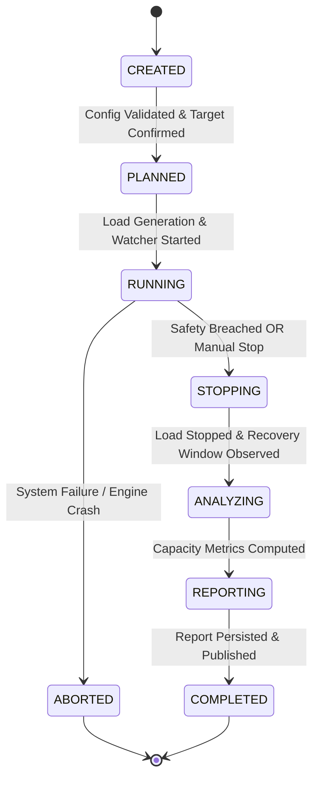
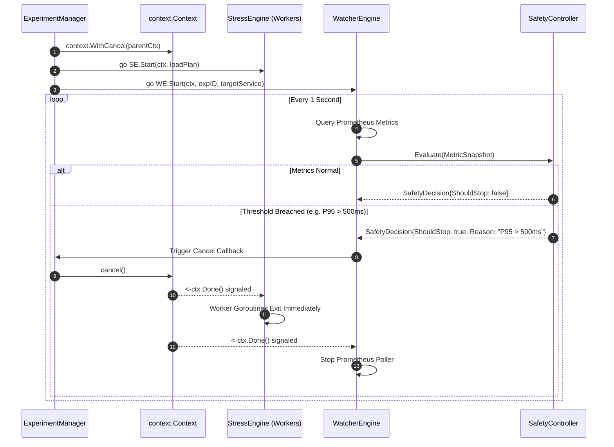

# DAMASCUS — Low-Level Design (LLD) Specification

**Detailed Technical Design, Interfaces, State Machine, Concurrency & Data Schemas**

---

## Table of Contents
1. [Domain Models & Data Structures](#1-domain-models--data-structures)
2. [Go Interface Specifications](#2-go-interface-specifications)
3. [Experiment State Machine](#3-experiment-state-machine)
4. [Concurrency & Context Cancellation Model](#4-concurrency--context-cancellation-model)
5. [Graph Analysis & Criticality Scoring Engine](#5-graph-analysis--criticality-scoring-engine)
6. [Safety Controller & Health Evaluation](#6-safety-controller--health-evaluation)
7. [Kafka Event Backbone & Messaging Schema](#7-kafka-event-backbone--messaging-schema)
8. [PostgreSQL Storage Schema (DDL)](#8-postgresql-storage-schema-ddl)
9. [REST API Specification](#9-rest-api-specification)

---

## 1. Domain Models & Data Structures

### 1.1 Experiment Core Types

```go
package experiment

import (
	"time"
)

type ExperimentState string

const (
	StateCreated   ExperimentState = "CREATED"
	StatePlanned   ExperimentState = "PLANNED"
	StateRunning   ExperimentState = "RUNNING"
	StateStopping  ExperimentState = "STOPPING"
	StateAnalyzing ExperimentState = "ANALYZING"
	StateReporting ExperimentState = "REPORTING"
	StateCompleted ExperimentState = "COMPLETED"
	StateAborted   ExperimentState = "ABORTED"
)

type ExperimentType string

const (
	ExperimentRamp ExperimentType = "ramp"
	ExperimentStep ExperimentType = "step"
)

type ExperimentConfig struct {
	InitialRate         int           `json:"initial_rate"`
	StepRate            int           `json:"step_rate"`
	MaxRate             int           `json:"max_rate"`
	StepDurationSeconds int           `json:"step_duration_seconds"`
	MaxP95LatencyMs     float64       `json:"max_p95_latency_ms"`
	MaxErrorRatePercent float64       `json:"max_error_rate_percent"`
	MinAvailabilityPct  float64       `json:"min_availability_pct"`
	RecoveryWindowSec   int           `json:"recovery_window_sec"`
}

type Experiment struct {
	ID            string           `json:"id"`
	TargetService string           `json:"target_service"`
	Type          ExperimentType   `json:"type"`
	Config        ExperimentConfig `json:"config"`
	State         ExperimentState  `json:"state"`
	StopReason    string           `json:"stop_reason,omitempty"`
	StartedAt     *time.Time       `json:"started_at,omitempty"`
	EndedAt       *time.Time       `json:"ended_at,omitempty"`
	CreatedAt     time.Time        `json:"created_at"`
}
```

### 1.2 Graph & Dependency Types

```go
package graph

type ServiceNode struct {
	Name string `json:"name"`
}

type DependencyEdge struct {
	From      string  `json:"from"`
	To        string  `json:"to"`
	CallCount int64   `json:"call_count"`
	Frequency float64 `json:"frequency"` // Calls per second
}

type DependencyGraph struct {
	Nodes map[string]*ServiceNode `json:"nodes"`
	Edges []DependencyEdge         `json:"edges"`
}

type ServiceScore struct {
	ServiceName string   `json:"service_name"`
	Score       float64  `json:"score"` // Normalized 0.0 to 1.0
	Reasons     []string `json:"reasons"`
}
```

### 1.3 Stress Engine Types

```go
package stress

import "time"

type LoadPlan struct {
	TargetURL    string        `json:"target_url"`
	InitialRate  int           `json:"initial_rate"`
	StepRate     int           `json:"step_rate"`
	MaxRate      int           `json:"max_rate"`
	StepDuration time.Duration `json:"step_duration"`
}
```

### 1.4 Watcher & Metric Types

```go
package watcher

import "time"

type MetricSnapshot struct {
	ExperimentID      string    `json:"experiment_id"`
	Timestamp         time.Time `json:"timestamp"`
	RequestRate       float64   `json:"request_rate"`
	P50LatencyMs      float64   `json:"p50_latency_ms"`
	P95LatencyMs      float64   `json:"p95_latency_ms"`
	P99LatencyMs      float64   `json:"p99_latency_ms"`
	ErrorRate         float64   `json:"error_rate"`
	Availability      float64   `json:"availability"`
	CPUUtilization    float64   `json:"cpu_utilization"`
	MemoryUtilization float64   `json:"memory_utilization"`
}
```

### 1.5 Safety Types

```go
package safety

type SafetyPolicy struct {
	MaxP95LatencyMs float64 `json:"max_p95_latency_ms"`
	MaxErrorRate    float64 `json:"max_error_rate"` // e.g. 0.05 for 5%
	MinAvailability float64 `json:"min_availability"` // e.g. 0.99 for 99%
}

type SafetyDecision struct {
	ShouldStop bool   `json:"should_stop"`
	Reason     string `json:"reason"`
}
```

### 1.6 Capacity & Reporting Types

```go
package capacity

import "time"

type Observation struct {
	Timestamp         time.Time `json:"timestamp"`
	LoadRate          int       `json:"load_rate"`
	P95LatencyMs      float64   `json:"p95_latency_ms"`
	ErrorRate         float64   `json:"error_rate"`
	Availability      float64   `json:"availability"`
	CPUUtilization    float64   `json:"cpu_utilization"`
	MemoryUtilization float64   `json:"memory_utilization"`
}

type CapacityResult struct {
	MaximumTestedRate      int           `json:"maximum_tested_rate"`
	MaximumSustainableRate int           `json:"maximum_sustainable_rate"`
	DegradationRate        int           `json:"degradation_rate"`
	SafetyBoundaryRate     int           `json:"safety_boundary_rate"`
	RecoveryTime           time.Duration `json:"recovery_time"`
}

type ExperimentReport struct {
	ExperimentID           string         `json:"experiment_id"`
	TargetService          string         `json:"target_service"`
	CriticalityScore       float64        `json:"criticality_score"`
	MaximumTestedRate      int            `json:"maximum_tested_rate"`
	MaximumSustainableRate int            `json:"maximum_sustainable_rate"`
	DegradationRate        int            `json:"degradation_rate"`
	SafetyBoundaryRate     int            `json:"safety_boundary_rate"`
	RecoveryTime           time.Duration  `json:"recovery_time"`
	Observations           []string       `json:"observations"`
	Recommendations        []string       `json:"recommendations"`
	GeneratedAt            time.Time      `json:"generated_at"`
}
```

---

## 2. Go Interface Specifications

To maintain strict loose coupling and testability, DAMASCUS components interact via standard Go interfaces:

```go
package damascus

import (
	"context"
	"time"
)

// GraphAnalyzer analyzes dependency telemetry and ranks services by criticality score
type GraphAnalyzer interface {
	Analyze(ctx context.Context) ([]graph.ServiceScore, error)
	GetGraph(ctx context.Context) (*graph.DependencyGraph, error)
}

// StressEngine executes controlled HTTP load tests against target microservices
type StressEngine interface {
	Start(ctx context.Context, plan stress.LoadPlan) error
	Stop()
}

// Watcher periodically queries metrics store and evaluates health
type Watcher interface {
	Start(ctx context.Context, experimentID string, targetService string) (<-chan watcher.MetricSnapshot, error)
	Stop()
}

// SafetyController evaluates metric snapshots against policy bounds
type SafetyController interface {
	Evaluate(snapshot watcher.MetricSnapshot) safety.SafetyDecision
}

// CapacityAnalyzer calculates performance thresholds and recovery timings
type CapacityAnalyzer interface {
	Analyze(observations []capacity.Observation, policy safety.SafetyPolicy) capacity.CapacityResult
}

// ReportEngine compiles reports into durable JSON and HTML deliverables
type ReportEngine interface {
	Generate(
		exp experiment.Experiment,
		capacity capacity.CapacityResult,
		scores []graph.ServiceScore,
		observations []capacity.Observation,
	) (capacity.ExperimentReport, error)
}

// ExperimentRepository defines persistent SQL interactions for experiment lifecycle
type ExperimentRepository interface {
	Create(ctx context.Context, exp *experiment.Experiment) error
	GetByID(ctx context.Context, id string) (*experiment.Experiment, error)
	UpdateState(ctx context.Context, id string, state experiment.ExperimentState, stopReason string) error
	SaveObservation(ctx context.Context, expID string, obs capacity.Observation) error
	GetObservations(ctx context.Context, expID string) ([]capacity.Observation, error)
	SaveReport(ctx context.Context, report capacity.ExperimentReport) error
	GetReport(ctx context.Context, expID string) (*capacity.ExperimentReport, error)
}

// EventProducer publishes asynchronous domain events to Kafka
type EventProducer interface {
	Publish(ctx context.Context, event events.Event) error
	Close() error
}
```

---

## 3. Experiment State Machine



### State Transition Validation Matrix

| Current State | Target State | Trigger / Conditions |
| :--- | :--- | :--- |
| `CREATED` | `PLANNED` | Target service validated & load plan parameterized. |
| `PLANNED` | `RUNNING` | Goroutines spawned for `StressEngine` and `WatcherEngine`. |
| `RUNNING` | `STOPPING` | Safety threshold breached (`SafetyController`) OR user invoked `/stop`. |
| `RUNNING` | `ABORTED` | `StressEngine` crash, telemetry loss, or database disconnection. |
| `STOPPING` | `ANALYZING` | Traffic ceased (0 req/s); observing recovery baseline window. |
| `ANALYZING` | `REPORTING` | `CapacityAnalyzer` computes sustainable rate, degradation & recovery time. |
| `REPORTING` | `COMPLETED` | JSON/HTML report written to Postgres and published to Kafka. |

---

## 4. Concurrency & Context Cancellation Model

The core control path requires deterministic, real-time context cancellation.



### Goroutine Worker Architecture inside `StressEngine`

```go
func (e *engine) Start(ctx context.Context, plan stress.LoadPlan) error {
	ticker := time.NewTicker(time.Second / time.Duration(plan.InitialRate))
	defer ticker.Stop()

	for {
		select {
		case <-ctx.Done():
			// Immediate shutdown on safety breach or manual stop
			return ctx.Err()
		case <-ticker.C:
			// Dispatch HTTP request worker asynchronously
			go e.sendRequest(ctx, plan.TargetURL)
		}
	}
}
```

---

## 5. Graph Analysis & Criticality Scoring Engine

### Criticality Score Formula

$$S(v) = w_1 \cdot \text{InDegree}(v) + w_2 \cdot \text{OutDegree}(v) + w_3 \cdot \text{CallFreq}(v) + w_4 \cdot \text{Depth}(v) + w_5 \cdot \text{SPOF}(v)$$

Where:
- $\text{InDegree}(v)$: Count of microservices dependent on service $v$.
- $\text{OutDegree}(v)$: Count of downstream dependencies service $v$ invokes.
- $\text{CallFreq}(v)$: Total requests per second directed to service $v$.
- $\text{Depth}(v)$: Maximum path distance from API Gateway.
- $\text{SPOF}(v)$: Binary or weighted metric if removing $v$ disconnects downstream graph nodes.
- Default weights: $w_1 = 0.35, w_2 = 0.15, w_3 = 0.25, w_4 = 0.10, w_5 = 0.15$.

Normalized final score $S(v) \in [0.0, 1.0]$.

---

## 6. Safety Controller & Health Evaluation

### Deterministic Threshold Logic

```go
func (c *SafetyController) Evaluate(snapshot watcher.MetricSnapshot) safety.SafetyDecision {
	if snapshot.P95LatencyMs > c.policy.MaxP95LatencyMs {
		return safety.SafetyDecision{
			ShouldStop: true,
			Reason:     fmt.Sprintf("P95 latency breached limit: %.2f ms > %.2f ms", snapshot.P95LatencyMs, c.policy.MaxP95LatencyMs),
		}
	}
	if snapshot.ErrorRate > c.policy.MaxErrorRate {
		return safety.SafetyDecision{
			ShouldStop: true,
			Reason:     fmt.Sprintf("Error rate breached limit: %.2f%% > %.2f%%", snapshot.ErrorRate*100, c.policy.MaxErrorRate*100),
		}
	}
	if snapshot.Availability < c.policy.MinAvailability {
		return safety.SafetyDecision{
			ShouldStop: true,
			Reason:     fmt.Sprintf("Availability breached limit: %.2f%% < %.2f%%", snapshot.Availability*100, c.policy.MinAvailability*100),
		}
	}
	return safety.SafetyDecision{ShouldStop: false}
}
```

---

## 7. Kafka Event Backbone & Messaging Schema

Kafka Topic: `experiment-events`

### Envelope Schema

```json
{
  "id": "evt_987654321",
  "experiment_id": "exp_123456789",
  "type": "THRESHOLD_BREACHED",
  "timestamp": "2026-08-14T18:30:00Z",
  "service": "order-service",
  "payload": {
    "breached_metric": "P95LatencyMs",
    "observed_value": 542.5,
    "threshold_value": 500.0,
    "reason": "P95 latency breached limit: 542.50 ms > 500.00 ms"
  }
}
```

---

## 8. PostgreSQL Storage Schema (DDL)

```sql
-- PostgreSQL DDL for DAMASCUS Control Plane

CREATE TABLE IF NOT EXISTS services (
    id VARCHAR(64) PRIMARY KEY,
    name VARCHAR(128) NOT NULL UNIQUE,
    created_at TIMESTAMP WITH TIME ZONE DEFAULT CURRENT_TIMESTAMP
);

CREATE TABLE IF NOT EXISTS dependencies (
    id SERIAL PRIMARY KEY,
    source_service VARCHAR(128) NOT NULL REFERENCES services(name),
    target_service VARCHAR(128) NOT NULL REFERENCES services(name),
    call_frequency DOUBLE PRECISION DEFAULT 0.0,
    observed_at TIMESTAMP WITH TIME ZONE DEFAULT CURRENT_TIMESTAMP
);

CREATE TABLE IF NOT EXISTS experiments (
    id VARCHAR(64) PRIMARY KEY,
    target_service VARCHAR(128) NOT NULL REFERENCES services(name),
    test_type VARCHAR(32) NOT NULL,
    status VARCHAR(32) NOT NULL,
    initial_rate INT NOT NULL,
    step_rate INT NOT NULL,
    max_rate INT NOT NULL,
    step_duration_seconds INT NOT NULL,
    max_p95_latency_ms DOUBLE PRECISION NOT NULL,
    max_error_rate DOUBLE PRECISION NOT NULL,
    min_availability DOUBLE PRECISION NOT NULL,
    stop_reason TEXT,
    started_at TIMESTAMP WITH TIME ZONE,
    ended_at TIMESTAMP WITH TIME ZONE,
    created_at TIMESTAMP WITH TIME ZONE DEFAULT CURRENT_TIMESTAMP
);

CREATE TABLE IF NOT EXISTS service_scores (
    id SERIAL PRIMARY KEY,
    experiment_id VARCHAR(64) REFERENCES experiments(id) ON DELETE CASCADE,
    service_name VARCHAR(128) NOT NULL,
    criticality_score DOUBLE PRECISION NOT NULL,
    reasons JSONB,
    calculated_at TIMESTAMP WITH TIME ZONE DEFAULT CURRENT_TIMESTAMP
);

CREATE TABLE IF NOT EXISTS observations (
    id SERIAL PRIMARY KEY,
    experiment_id VARCHAR(64) NOT NULL REFERENCES experiments(id) ON DELETE CASCADE,
    timestamp TIMESTAMP WITH TIME ZONE NOT NULL,
    load_rate INT NOT NULL,
    p95_latency DOUBLE PRECISION NOT NULL,
    error_rate DOUBLE PRECISION NOT NULL,
    availability DOUBLE PRECISION NOT NULL,
    cpu_utilization DOUBLE PRECISION NOT NULL,
    memory_utilization DOUBLE PRECISION NOT NULL
);

CREATE TABLE IF NOT EXISTS safety_events (
    id SERIAL PRIMARY KEY,
    experiment_id VARCHAR(64) NOT NULL REFERENCES experiments(id) ON DELETE CASCADE,
    event_type VARCHAR(64) NOT NULL,
    reason TEXT NOT NULL,
    timestamp TIMESTAMP WITH TIME ZONE DEFAULT CURRENT_TIMESTAMP
);

CREATE TABLE IF NOT EXISTS reports (
    experiment_id VARCHAR(64) PRIMARY KEY REFERENCES experiments(id) ON DELETE CASCADE,
    maximum_tested_rate INT NOT NULL,
    maximum_sustainable_rate INT NOT NULL,
    degradation_rate INT NOT NULL,
    safety_boundary_rate INT NOT NULL,
    recovery_time_seconds DOUBLE PRECISION NOT NULL,
    report_data JSONB NOT NULL,
    created_at TIMESTAMP WITH TIME ZONE DEFAULT CURRENT_TIMESTAMP
);
```

---

## 9. REST API Specification

| HTTP Method | Path | Description | Request Body | Response Body |
| :--- | :--- | :--- | :--- | :--- |
| `POST` | `/api/experiments` | Create a new experiment draft | `CreateExperimentDTO` | `Experiment` object |
| `POST` | `/api/experiments/{id}/start` | Trigger execution of experiment | None | `{"status": "RUNNING"}` |
| `POST` | `/api/experiments/{id}/stop` | Manually abort running experiment | `{"reason": "string"}` | `{"status": "STOPPING"}` |
| `GET` | `/api/experiments/{id}` | Retrieve experiment details | None | `Experiment` object |
| `GET` | `/api/experiments/{id}/status` | Get live metrics & state | None | Live metrics DTO |
| `GET` | `/api/dependencies` | Fetch dependency graph & scores | None | Graph & `[]ServiceScore` |
| `GET` | `/api/experiments/{id}/report` | Retrieve completed report | None | `ExperimentReport` JSON |
